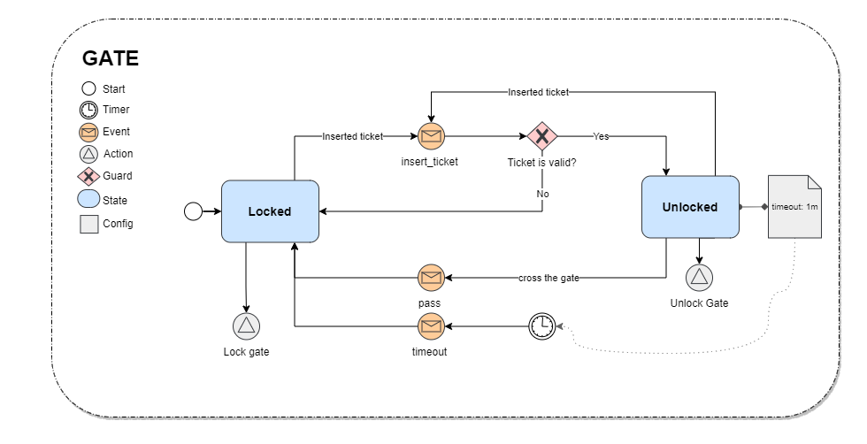

# Automata || Máquina de Estados em PHP

Automata — é um pacote escrito em PHP para uma Máquina de Estados. Ele permite gerenciar qualquer objeto que possua
estados definidos e transições entre esses eles, incluindo a definição de ações e regras de timeout.

## O que é uma máquina de estado?

Uma Máquina de Estados, também conhecida como Autômato, é uma forma de executar um processo passo a passo, baseada em
diferentes estados. Cada processo deve estar em um único estado de cada vez, como "INICIADO", "PENDENTE", "EM
ANDAMENTO", etc., e a transição para outro estado é feita de acordo com uma lógica ou condição específica. Essa condição
pode ser baseada em um campo, um tempo ou uma função personalizada.

[Leia mais sobre o conceito de State Machine.](./docs/concept-of-state-machine.md)

## Recursos

- Permite a transição de objetos [Stateables](./src/Interfaces/States/Stateable.php) entre
  diferentes [States](./src/Interfaces/States/State.php).
- Gerencia e define as [transições](./src/Transition.php) de estado dentro
  da [Máquina de Estado](./src/StateMachine.php).
- Oferece suporte para ações específicas no estado atual.
- Oferece suporte para ações de transições.
- Fornece suporte para gatilhos de eventos que podem desencadear transições de estado.
- Fornece suporte a timeout de [States](./src/Interfaces/States/State.php), permitindo transições automáticas para um
  novo estado após expiração.
- Fornece suporte a regras de Guard, condições que validam uma transição.
- Oferece Callback ao Guard falhar, permitindo que a aplicação execute uma ação específica quando uma regra de Guard
  falha.

## Instalar

Para instalar a biblioteca, basta usar o composer e adicionar o pacote `dump\automata` no seu projeto.

```bash
composer required dump\automata
```

## Exemplo rápido

Imagine que você esteja em uma estação de metrô e precise passar pela catraca para acessar o trem. A catraca só permite
o acesso se você tiver um bilhete válido. Esse é um exemplo simples, que pode ser representada
por dois estados: `Locked` e `Unlocked`.



O estado `Locked` representa a catraca fechada e só será aberta quando o evento `insert_ticket` for acionado após a
leitura do bilhete. Esse evento de transição tem um `Guard` que valida o bilhete, e se ele for válido, muda o estado da
catraca para `Unlocked`.

Já o estado `Unlocked` tem uma ação vinculada a ele que libera a catraca e um timeout de 30 segundos para fechar, caso o
evento `pass_gate` não seja acionado. A transição `pass_gate` é disparada quando o usuário passa pela catraca, fazendo a
transição do estado para `Locked` e bloqueando a catraca na ação subsequente da `Locked`.

Este cenário poderia ser configurado da seguinte maneira no pacote Automata:

```php

use Automata\StateMachine;
use Automata\Builders\StateBuilder as State;
use Automata\Builders\TransitionBuilder as Transition;

$gateStateMachine = StateMachine::configure('GATE')
        ->addInitialState('Locked')
        ->addStates([
            State::make('Locked')->action(fn () => 'Lock Gate'),
            State::make('Unlocked')->action(fn () => 'Unlock Gate')->timeout(30),
        ])
        ->addTransitions([
            Transition::make('inserted_ticket')
                ->source('Locked')
                ->target('Unlocked')
                ->guard(fn () => 'Ticket is valid'),

            Transition::make('pass_gate')
                ->source('Unlocked')
                ->target('Locked'),

            Transition::make('timeout')
                ->source('Unlocked')
                ->target('Locked'),
        ]);
```

Nessa configuração, os estados Locked e Unlocked são definidos, cada um com suas ações e eventos associados. A transição
inserted_ticket é definida para mudar o estado de Locked para Unlocked caso o bilhete seja válido. A transição pass_gate
é definida para mudar o estado de Unlocked para Locked quando o usuário passa pela catraca. Por fim, a transição timeout
é definida para mudar o estado de Unlocked para Locked caso o timeout de 30 segundos expire antes que o usuário passe
pela catraca.

Para disparar os eventos, basta utilizar o método trigger da instância da máquina de estados configurada, como no
exemplo abaixo:

```php

    $gateStateMachine = \Automata\StateMachine::loadConfiguration('GATE')
                                                ->initialize($gateStateable);
    
    echo $gateStateMachine->getCurrentState();
    // Locked
    
    $gateStateMachine->trigger('inserted_ticket');

    echo $gateStateMachine->getCurrentState();
    // Unlocked
```

## Documentação

### Terminologia

A lista abaixo representa os componentes de maquina de estado e o que eles representam dentro do pacote.

- **State Machine:** A State Machine é responsável por gerenciar todos os estados e transições, além de fornecer métodos
  para executar ações específicas em cada estado. Ela é o componente que define o comportamento geral da máquina de
  estados.

- **State:** é a principal entidade da máquina de estados onde suas transições são dirigidas por eventos. Representa um
  modelo em que a máquina de estados pode permanecer.

    - **Simples:** Como o nome sugere, o estado simples é o mais básico e contém apenas um atributo que é o seu nome,
      geralmente representado por um enum ou uma string.

    - **Complexo:** O estado complexo é aquele que possui atributos adicionais, além do nome, como o timeout e actions.

    - **Composto:** O estado composto é aquele que depende de outros estados para ser concluído. Ele é composto por
      estados internos e uma transição para um estado externo.

- **Events:** é uma entidade enviada para a máquina de estados que determina, a partir de um estado origem, a
  mudança de estado.

- **Guards:** é uma expressão booleana avaliada dinamicamente que afeta o comportamento da máquina de estados,
  habilitando ações e transições apenas quando ela for avaliada como verdadeira.

- **Transitions:** é a relação entre um estado origem e um estado alvo.

- **Actions:** é um comportamento executado durante o disparo de uma transição. Ela pode ser uma ação de entrada, isto
  é, a ação executada ao entrar no estado; ou de saída, isto é, a ação executada ao sair do estado.

- **Trigger:** Representa um evento gatilho que pode desencadear uma transição de estado na máquina de estados, podendo
  ser acionado por um evento ou por um timer.
